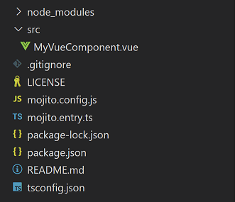

# 你的第一个组件库

自定义组件库是Mojito是核心能力之一，你可以使用React、Vue、antd、element-plus、echarts...无数优秀的前端框架构建出可以在Mojito使用的组件，你无需担心样式冲突，组件可相互通讯。

### 快速开始

node >= 16

```js
npx create-mojito-pack
```
根据提示输入你的组件库名称和选择组件库类型（React | Vue）

### 注意

组件库目前只支持使用TS开发，建议开发前了解TS的基本用法

### 基本结构



- mojito.config.js： 打包配置文件，基于Webpack 5
- mojito.entry.ts：打包时自动生成，一般无需关注
- src/MyVueComponent.vue：组件代码

### 组件代码解释

```js
<template>
	<div>{{ text }}</div>
</template>

<script lang="ts">
import { CreatePack } from "@drinkjs/mojito-vue-pack";
import { defineComponent } from "vue";

// 常规vue组件定义
const Text = defineComponent({
	props: {
		text: String,
	},
});

export default Text;

// 定义Mojito组件
export const PackText = CreatePack(Text, {
	name: "文本", // 组件的名称
	category: "基础组件", // 组件分类
    // 组件props定义
	props: {
		text: {  // 对应vue中props中的定义
			name: "文字", // 属性名称
			type: "string", // 属性类型
			default: "这里显示文本...", // 默认值
		},
        ... // 更多属性
	},
});
</script>

```

### 运行调试
```js
npm run dev
```

### 打包
```
npm run build
```

